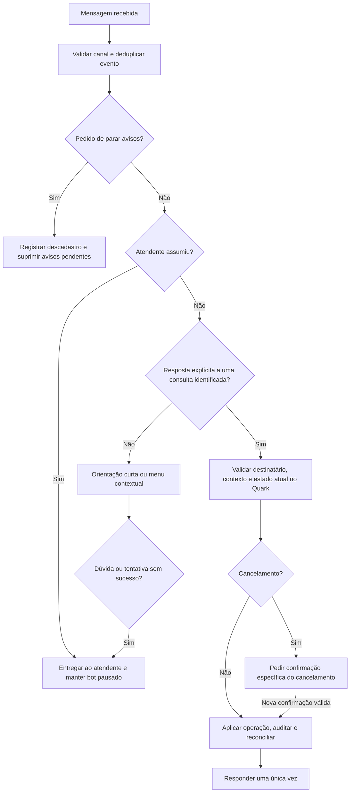

# Revisão do bot, WhatsApp, Quark e experiência de atendimento

> Avaliação histórica, anterior à implementação. As linhas citadas se referem àquela versão. Por decisão do usuário, a API não oficial foi preservada; a migração sugerida abaixo não é requisito. Consulte o [guia dos ajustes implementados](messaging-safety-rollout.md).

Data: 27/08/2026. Escopo: código local, documentação pública dos fornecedores, testes isolados e inspeção visual do frontend com dados fictícios. Esta revisão não alterou regras de envio, credenciais ou ambiente de produção.

## Recomendação executiva

Não recomendo ampliar os envios nem manter cancelamento autônomo com o interpretador atual. A aplicação utiliza `whaileys` ou `whatsapp-web.js`, não a API oficial do WhatsApp. Recomendo migrar o transporte para a WhatsApp Business Platform, corrigir interpretação e repetição de mensagens, e só então ampliar a automação. Não existe promessa responsável de risco zero de banimento, inclusive na plataforma oficial.

A política do WhatsApp exige permissão para contatos posteriores e respeito ao descadastro; na Business Platform, mensagens fora da janela de 24 horas precisam de templates aprovados. Ela também exige uma alternativa clara de atendimento humano para automação. Acesso pode ser limitado por violações ou feedback negativo. [Política oficial](https://business.whatsapp.com/policy).

As diretrizes também tratam clientes não oficiais, automação abusiva e contatos repetidos indesejados. Intervalos aleatórios não resolvem o risco do transporte nem tornam um envio permitido. [Diretrizes de mensagens](https://www.whatsapp.com/legal/messaging-guidelines).

## 1. Achados prioritários

### P1 — Interpretador pode cancelar uma consulta por uma frase comum

**Reproduzido localmente no parser**, sem qualquer chamada ao Quark:

| Texto recebido | Resultado atual |
| --- | --- |
| Não quero cancelar | Cancelar |
| Não sei o endereço | Cancelar |
| Sim, preciso remarcar | Confirmar |
| 2 pessoas | Cancelar |
| SIM 2 | Confirmar a segunda consulta da lista atual |
| PARAR | Não reconhecido como comando de confirmação |

As expressões regulares aceitam o início da frase. Quando existe consulta futura `AGENDADO` aguardando confirmação, o handler pode aplicar essa interpretação ao Quark. Os números 1 e 2 também são usados pelo menu de filas. O handler de confirmação é executado antes da lógica de filas e não exige ausência de atendente responsável.

**Correção proposta:** comandos completos e inequívocos, contexto persistido da consulta, suspensão de interpretação automática durante atendimento humano e confirmação adicional para cancelamento. Um texto ambíguo nunca deve modificar a agenda. Na integração oficial, preferir ações com identificador da consulta, sempre validado no servidor.

Evidências: [parser](C:/Users/Bruno/Desktop/Apps/WhatQuark-master/WhatQuark-master/backend/src/services/QuarkClinicServices/appointmentUtils.ts:205), [aplicação da resposta](C:/Users/Bruno/Desktop/Apps/WhatQuark-master/WhatQuark-master/backend/src/services/QuarkClinicServices/HandleQuarkConfirmationReply.ts:85), [ordem do fluxo](C:/Users/Bruno/Desktop/Apps/WhatQuark-master/WhatQuark-master/backend/src/handlers/handleWhatsappEvents.ts:305).

### P1 — Não há consentimento e descadastro como barreira central de envio

Não encontrei um cadastro estruturado de autorização, tratamento central de PARAR/SAIR ou lista de supressão consultada por todos os caminhos de envio. Um telefone válido importado do Quark não comprova autorização. A sincronização gera notificações para todos os telefones encontrados no agendamento, inclusive alternativos.

**Correção proposta:** registrar autorização com origem, data, finalidade e versão do texto; cadastrar o vínculo do responsável quando o telefone não for do paciente; escolher o destinatário autorizado principal. PARAR deve impedir novos avisos proativos e suprimir os pendentes imediatamente. Atendimento solicitado pelo próprio paciente precisa continuar acessível, sem reativar automaticamente lembretes.

Reduzir o conteúdo inicial: o template atual inclui nome, profissional, procedimento e unidade. Evitar procedimento e outros detalhes desnecessários, principalmente em telefones compartilhados. Submeter a política de dados à avaliação jurídica da clínica; esta revisão técnica não é um parecer de conformidade.

Evidências: [destinatários](C:/Users/Bruno/Desktop/Apps/WhatQuark-master/WhatQuark-master/backend/src/services/QuarkClinicServices/SyncQuarkAppointmentsService.ts:83), [conteúdo](C:/Users/Bruno/Desktop/Apps/WhatQuark-master/WhatQuark-master/backend/src/services/QuarkClinicServices/messageTemplates.ts:23).

### P1 — O limite horário não controla todos os envios

O limite padrão de 100/h conta somente notificações Quark com status SENT. Menu do bot, respostas de confirmação, despedidas, inatividade, relatórios e envios manuais/API não compartilham essa contagem. Os intervalos do worker também não constituem uma reserva atômica entre réplicas.

**Correção proposta:** uma fila de saída compartilhada, com política por canal e destinatário, reserva atômica de capacidade, prioridade para atendimento, deduplicação e pausa global. Todos os produtores devem passar por ela. Separar avisos clínicos e relatórios internos na experiência operacional; preferir o próprio painel para relatórios quando possível.

Não há um número universal de mensagens/hora que garanta ausência de bloqueio. Os valores devem refletir permissões, demanda e limites efetivamente aplicáveis ao canal.

Evidências: [contagem Quark](C:/Users/Bruno/Desktop/Apps/WhatQuark-master/WhatQuark-master/backend/src/services/QuarkClinicServices/QuarkNotificationWorker.ts:97), [envio direto do menu](C:/Users/Bruno/Desktop/Apps/WhatQuark-master/WhatQuark-master/backend/src/handlers/handleWhatsappEvents.ts:165).

### P1 — Uma mensagem enviada pode ser reenviada após falha de persistência

O worker envia pelo WhatsApp e depois grava SENT e atualiza a consulta. Se uma dessas gravações falhar, o catch pode colocar a mesma notificação em retry. A recuperação de PROCESSING expirado também agenda retry sem primeiro verificar se o envio ocorreu. O serviço genérico pode devolver erro após o provedor ter enviado, caso falhe a atualização do ticket.

**Correção proposta:** separar falha confirmada de envio de resultado desconhecido. Persistir a tentativa e a identidade da operação, reconciliar confirmação/eco do provedor quando disponível e nunca repetir automaticamente um resultado incerto. Uma chave única da outbox impede duplicar a intenção; sozinha não garante entrega única. A recuperação dos relatórios diários já possui reconciliação com mensagem persistida e oferece uma referência interna parcial.

Evidências: [envio e gravação](C:/Users/Bruno/Desktop/Apps/WhatQuark-master/WhatQuark-master/backend/src/services/QuarkClinicServices/QuarkNotificationWorker.ts:171), [recuperação](C:/Users/Bruno/Desktop/Apps/WhatQuark-master/WhatQuark-master/backend/src/services/QuarkClinicServices/QuarkNotificationWorker.ts:69), [serviço genérico](C:/Users/Bruno/Desktop/Apps/WhatQuark-master/WhatQuark-master/backend/src/services/WbotServices/SendWhatsAppMessage.ts:37).

### P1 — Modo de teste e pausa não cobrem todos os efeitos externos

`QUARK_DRY_RUN=true` pausa o worker de notificações. O handler de respostas não verifica esse campo nem a allowlist antes de confirmar/cancelar ou responder pelo WhatsApp. A confirmação manual no dashboard também chama o Quark sem essas verificações. O endpoint manual não consulta `QUARK_INTEGRATION_ENABLED`.

Isso não prova que houve operação indevida em produção, mas impede considerar esses parâmetros um ambiente de simulação completo ou uma chave global de emergência.

**Correção proposta:** política única de execução com modos DESLIGADO, SIMULAÇÃO, TESTE RESTRITO e PRODUÇÃO; verificar o modo imediatamente antes de cada efeito externo. Se a confirmação manual continuar permitida durante pausa de automação, declarar isso claramente na tela e separar a permissão. Modo de simulação deve executar zero chamadas de escrita e zero envios reais.

Evidências: [dry-run no worker](C:/Users/Bruno/Desktop/Apps/WhatQuark-master/WhatQuark-master/backend/src/services/QuarkClinicServices/QuarkNotificationWorker.ts:262), [handler](C:/Users/Bruno/Desktop/Apps/WhatQuark-master/WhatQuark-master/backend/src/services/QuarkClinicServices/HandleQuarkConfirmationReply.ts:91), [ação manual](C:/Users/Bruno/Desktop/Apps/WhatQuark-master/WhatQuark-master/backend/src/services/QuarkClinicServices/ConfirmQuarkAppointmentFromDashboardService.ts:82).

### P1 — Fechamento pelo navegador pode gerar despedidas repetidas

Se `VITE_HOURS_CLOSE_TICKETS_AUTO` for maior que zero, o hook de listagem fecha tickets antigos por requisições PUT. Ele é usado também no dashboard. Duas abas ou operadores podem executar a mesma decisão. O controller envia despedida sempre que o resultado está fechado, sem verificar se ocorreu uma nova transição de estado. O valor real em produção não foi consultado.

**Correção proposta:** retirar automação de fechamento dos hooks de leitura. Usar exclusivamente uma rotina no servidor com decisão atômica e despedida única por transição. A rotina de inatividade já existente deve ser o ponto de partida, preservando a autorização explícita do atendente.

Evidências: [hook](C:/Users/Bruno/Desktop/Apps/WhatQuark-master/WhatQuark-master/frontend/src/hooks/useTickets/index.js:39), [despedida](C:/Users/Bruno/Desktop/Apps/WhatQuark-master/WhatQuark-master/backend/src/controllers/TicketController.ts:118).

### P2 — Menu repetitivo e resposta atrasada depois da transferência

O debounce de três segundos só agrupa eventos próximos. Não existe estado persistido de menu exibido, limite de tentativas ou transferência por intenção como “atendente”. Uma resposta fora das opções pode receber o menu novamente. O callback atrasado não consulta se o ticket já ganhou fila ou atendente; escolher uma opção não cancela explicitamente o menu pendente.

**Correção proposta:** estado da conversa, no máximo uma reapresentação útil antes de encaminhar ao humano, comando de ajuda e cancelamento dos timers ao mudar de estado. Deduplicar mensagens de entrada antes dos efeitos do bot e serializar decisões por conversa. O upsert da mensagem não substitui a deduplicação dos efeitos.

Evidências: [menu](C:/Users/Bruno/Desktop/Apps/WhatQuark-master/WhatQuark-master/backend/src/handlers/handleWhatsappEvents.ts:134), [debounce](C:/Users/Bruno/Desktop/Apps/WhatQuark-master/WhatQuark-master/backend/src/helpers/Debounce.ts:22).

## 2. Fluxo de atendimento recomendado

O diagrama descreve uma proposta, não o comportamento implementado. Descadastro de avisos não deve excluir acesso ao atendimento. A confirmação de cancelamento exige uma nova resposta válida e vinculada à consulta; apenas mostrar a pergunta não autoriza a operação.

Para avisos proativos: autorização válida → destinatário correto → estado da consulta atualizado → template/janela aplicável → frequência e horário → fila única → envio → confirmação ou reconciliação. Reavaliar essas condições na hora do envio, não somente ao enfileirar.

Como ponto de partida de produto, proponho um aviso útil por evento e um lembrete antes da consulta, com supressão após confirmação. Manter o lembrete de duas horas somente se houver necessidade demonstrada e preferência do paciente. Isso é uma escolha inicial de experiência, não um limite de segurança publicado pelo WhatsApp.

## 3. Integração Quark: o que preservar e melhorar

### Contrato público conferido

Consultei o Swagger e o JSON público da especificação sem enviar credenciais nem consultar pacientes. O contrato descreve GET `/v1/agendamentos`, datas `dd-MM-yyyy`, intervalo máximo de 30 dias, páginas com até 100 registros, PATCH de confirmação e cancelamento e os headers utilizados pelo cliente. Ambos os PATCH são descritos para agendamentos no estado AGENDADO. Há também GET por ID para consultar o estado antes de reconciliar uma operação. [Swagger](https://api.quark.tec.br/clinic/ext/swagger-ui.html), [especificação pública](https://api.quark.tec.br/clinic/ext/v2/api-docs).

O cliente local está alinhado com esses endpoints e parâmetros. Ainda é necessária homologação autenticada: permissões da organização, paginação real, interpretação do horário retornado e comportamento após timeout não foram comprovados com o fornecedor.

### Controles existentes que valem preservar

- Baseline inicial silenciosa em duas varreduras, evitando avisar toda a agenda importada.
- Outbox persistente com chave única, tentativas e fila de falhas para revisão.
- Horário silencioso, allowlist no worker e supressão de notificações vencidas/substituídas.
- Restrição administrativa no dashboard e auditoria de decisões.
- Ausência de uma consulta em uma resposta não é tratada automaticamente como cancelamento.

### Melhorias de consistência

| Problema | Ajuste recomendado |
| --- | --- |
| PATCH pode ser repetido após timeout embora já aplicado | Consultar GET por ID; reconhecer o estado desejado ou encaminhar resultado desconhecido para revisão. Respeitar Retry-After quando fornecido. |
| SIM 2 depende da ordem atual das consultas, que pode mudar | Persistir a lista oferecida e usar identificador de consulta, destinatário, versão e validade. |
| Notificação PROCESSING não é suprimida pela confirmação | Revalidar estado e versão antes do envio; não restaurar awaitingConfirmation para uma consulta já resolvida. |
| Sincronização escreve awaitingConfirmation a partir de leitura anterior | Separar dados da agenda e estado da conversa; aplicar controle de concorrência/versionamento. |
| Nova consulta/outbox/auditoria são gravadas em etapas separadas | Persistir o evento e a intenção de envio na mesma transação; evitar envio antes da conclusão local. |
| Lembrete de saída chama FindOrCreateTicket e pode reabrir atendimento | Separar notificação proativa de demanda de atendimento; abrir fila humana quando houver resposta ou intervenção necessária. |
| Horizonte de 365 dias reconsultado a cada cinco minutos | Janela próxima frequente e horizonte distante menos frequente; avaliar suporte oficial a eventos com o Quark, sem presumir webhook existente. |
| Paginação para em 100 páginas sem sinalizar truncamento | Usar metadados disponíveis e falhar de forma explícita se o limite local for atingido com página cheia. |
| Mensagem fixa diz “hoje/amanhã” com base no tipo do lembrete | Preferir data/hora absolutas ou renderizar no envio; fila/horário silencioso podem atravessar a meia-noite. |
| Formatação/parsing usa fuso do processo, distinto da configuração de horários silenciosos | Usar explicitamente o fuso da clínica em parsing, comparação e renderização. |
| Templates sempre pedem confirmação mesmo quando estado não permite confirmar | Renderizar CTA conforme estado e finalidade; evitar convite que o backend não consegue atender. |
| “Nossa equipe foi avisada” sem encaminhamento operacional explícito nesse catch | Criar tarefa/alerta com responsável e prazo; só então prometer acompanhamento. |
| Registro de ação manual informa DASHBOARD, mas não o operador | Acrescentar actorUserId e contexto da alteração, com retenção e acesso definidos. |
| Provider registra payload bruto quando LOG_LEVEL=debug | Remover corpo e identificadores dos logs, incluindo caminhos de depuração. |

Referências adicionais: [cliente HTTP](C:/Users/Bruno/Desktop/Apps/WhatQuark-master/WhatQuark-master/backend/src/services/QuarkClinicServices/QuarkClinicClient.ts:71), [seleção de consulta](C:/Users/Bruno/Desktop/Apps/WhatQuark-master/WhatQuark-master/backend/src/services/QuarkClinicServices/HandleQuarkConfirmationReply.ts:139), [concorrência](C:/Users/Bruno/Desktop/Apps/WhatQuark-master/WhatQuark-master/backend/src/services/QuarkClinicServices/SyncQuarkAppointmentsService.ts:287), [ticket proativo](C:/Users/Bruno/Desktop/Apps/WhatQuark-master/WhatQuark-master/backend/src/services/QuarkClinicServices/SendQuarkWhatsAppMessage.ts:48), [log bruto](C:/Users/Bruno/Desktop/Apps/WhatQuark-master/WhatQuark-master/backend/src/providers/WhatsApp/Implementations/whaileys.ts:992).

O iframe “Quark Clinic” é uma sessão independente, não integração de identidade. A própria tela orienta logout separado em computadores compartilhados. O caminho de evolução é trazer o contexto necessário da agenda para o atendimento por API, mantendo o acesso ao sistema completo separado. Não remover proteções de iframe ou compartilhar credenciais para simular SSO.

## 4. UX/UI: avaliação e direção proposta

### O que foi observado na prévia

Usei o build real do frontend com um servidor local de respostas fictícias. Nenhum backend operacional foi iniciado. A faixa amarela das capturas foi adicionada apenas para identificar a demonstração e não pertence ao produto.

| Achado | Evidência / efeito |
| --- | --- |
| Ações do cabeçalho ficam fora da área visível | Em 1280 px, Resolver começou aproximadamente no x=1319. Também ficou cortado em 390 px. |
| Etiquetas sobrepostas na lista | Canal, contador e “Aguardando paciente” competem pela mesma área; nomes e última mensagem perdem espaço. |
| Tema escuro incompleto | Cabeçalho e editor mantêm fundo claro com texto herdado claro, prejudicando fortemente a leitura. |
| Painel Quark coloca métricas antes do trabalho | Doze cards e gráficos vêm antes das consultas; ações começam abaixo da primeira tela. |
| Filtros com pouca largura | Rótulos de situação ficam apertados na largura de desktop testada. |
| Idioma e nomes inconsistentes | Tickets, Inbox, Dashboard e textos em português convivem; existem rótulos ARIA genéricos/em inglês e controles sem nome. |
| Contexto clínico separado da conversa | O drawer mostra contato e informações extras, mas não a agenda, autorização de avisos e estado do bot. |

Capturas: [conversa desktop](C:/Users/Bruno/Desktop/Apps/WhatQuark-master/WhatQuark-master/docs/review-assets/2026-08-27/chat-desktop.png), [conversa celular](C:/Users/Bruno/Desktop/Apps/WhatQuark-master/WhatQuark-master/docs/review-assets/2026-08-27/chat-mobile.png), [tema escuro](C:/Users/Bruno/Desktop/Apps/WhatQuark-master/WhatQuark-master/docs/review-assets/2026-08-27/chat-dark.png), [painel Quark](C:/Users/Bruno/Desktop/Apps/WhatQuark-master/WhatQuark-master/docs/review-assets/2026-08-27/quark-desktop.png).

### Direção visual e organização

Preservar a identidade verde da clínica, com fundos neutros, contraste consistente e uma única ação principal por contexto. Reduzir gradientes, excesso de negrito, etiquetas sobrepostas e o papel de parede do chat. A aparência deve ajudar a ler, decidir e evitar erros durante horas de atendimento.

| Área | Proposta |
| --- | --- |
| Navegação | Atendimento, Agenda, Pacientes e Indicadores; configurações e conexões agrupadas em Administração. “Quark Clinic” separado de “Automação”. |
| Atendimento em desktop | Lista com largura ajustável, conversa central e painel contextual recolhível à direita. Em telas menores, duas áreas; no celular, uma por vez. |
| Lista de conversas | Nome, trecho da última mensagem, tempo de espera e estado legível em linhas próprias; filtros “Meus”, “Aguardando equipe”, “Aguardando paciente”, “Resolvidos”. |
| Cabeçalho | Nome e responsável; ação principal “Resolver”; transferir e aguardar em menu acessível. Nunca esconder ações por overflow. |
| Painel do paciente | Próxima consulta, unidade, estado no Quark, último sync, responsável autorizado, preferências de mensagens e histórico de eventos. Exibir somente o permitido ao perfil. |
| Editor | Rascunho por ticket, prévia de anexos, respostas rápidas pesquisáveis, estado enviando/enviado/erro e opção consciente de retry. Identificar mensagem manual, bot e Quark. |
| Painel de automação | Primeiro: falhas, pendências próximas e ações necessárias. Depois: quatro métricas úteis e análises em uma aba própria. |
| Estado operacional | Canal conectado/desconectado, modo de simulação, última sincronização, bot pausado, próximo aviso previsto e motivo de supressão. Não confundir conectado com qualidade boa da conta. |
| Ações sensíveis | Diálogo específico com consulta, destinatário e efeito. Para lembrete, mostrar texto e quantidade de destinatários antes da confirmação. |
| Qualidade de uso | Skeletons, vazio com orientação, erro localizado sem apagar dados anteriores, filtros preservados, foco visível e navegação completa por teclado. |

Tokens sugeridos: escala de espaçamento 4/8/12/16/24/32, texto de trabalho 14–16 px, raios 8–12 px, uma família tipográfica carregada de fato, cores semânticas para sucesso/atenção/erro. Priorizar toque confortável de 44 px como meta de produto. Para verificação de acessibilidade, usar WCAG 2.2 AA: contraste normal de pelo menos 4,5:1 e avaliação de tamanho/espaçamento de alvos conforme as exceções da norma. [Contraste](https://www.w3.org/WAI/WCAG22/Understanding/contrast-minimum.html), [alvos](https://www.w3.org/WAI/WCAG22/Understanding/target-size-minimum.html).

### Ajustes técnicos que afetam a experiência

- O gráfico “Entradas de atendimento hoje” usa a listagem paginada de tickets, limitada a 40 registros por página, e apenas horários de 08h a 19h. Criar agregação no backend para não apresentar um subconjunto como total do dia.
- O editor limpa o texto na troca de ticket. Persistir rascunhos por usuário/conversa, com limpeza segura ao logout, sem transformar isso em armazenamento indefinido de dados clínicos.
- O contador de inatividade do frontend fixa 15 minutos; ele deve exibir o prazo real recebido do servidor.
- Há imports imediatos de todas as páginas. Dividir por rota e carregar editor de áudio/emoji/gráficos quando necessários. O arquivo principal do build examinado tem aproximadamente 1,61 MB sem compressão; isso não é uma medição de tempo real de carregamento.
- Corrigir `lang` do documento para pt-BR, nomes de controles, áreas clicáveis sem suporte a teclado e textos do produto.
- Evoluir React/Material UI por etapas, com testes de comportamento e migração controlada; trocar a biblioteca visual inteira não deve bloquear as correções de risco.

Referências: [gráfico](C:/Users/Bruno/Desktop/Apps/WhatQuark-master/WhatQuark-master/frontend/src/pages/Dashboard/Chart.js:25), [paginação](C:/Users/Bruno/Desktop/Apps/WhatQuark-master/WhatQuark-master/backend/src/services/TicketServices/ListTicketsService.ts:138), [editor](C:/Users/Bruno/Desktop/Apps/WhatQuark-master/WhatQuark-master/frontend/src/components/MessageInput/index.js:240), [prazo fixo](C:/Users/Bruno/Desktop/Apps/WhatQuark-master/WhatQuark-master/frontend/src/components/TicketActionButtons/index.js:36), [rotas](C:/Users/Bruno/Desktop/Apps/WhatQuark-master/WhatQuark-master/frontend/src/routes/index.js:6).

## 5. Sequência de implementação recomendada

| Etapa | Entrega | Critério de aceite |
| --- | --- | --- |
| 1 — Contenção | Parser estrito, confirmação de cancelamento, pausa global, simulação sem efeitos e fechamento único | Frases ambíguas não alteram agenda; teste não envia; duas abas não geram duas despedidas. |
| 2 — Mensageria | Autorização/descadastro, fila única, deduplicação de entrada/saída, reconciliação e limites atômicos | PARAR suprime pendências; falha após aceite não causa retry cego; operador assumindo cancela bot pendente. |
| 3 — Plataforma oficial | Novo provider, templates aprovados, janela de atendimento, recebimento e status de entrega | Fluxo homologado em ambiente/números autorizados; sem duplicação entre transportes; plano explícito para migração do número. |
| 4 — Quark consistente | Contexto por consulta, revalidação, auditoria por operador, estados desconhecidos e fila de intervenção | Alteração simultânea, timeout e múltiplas consultas não geram decisão na consulta errada. |
| 5 — Frontend | Layout responsivo, tema consistente, contexto da agenda, rascunhos e painel de exceções | Ações acessíveis em celular/desktop; teclado e contraste verificados; indicadores conferem com os dados agregados. |

As correções da etapa 1 podem começar enquanto a migração oficial é planejada. Não aumentaria volume como parte dessas mudanças. Para reduzir exposição imediatamente, recomendo pausar os avisos proativos e o cancelamento autônomo até corrigir as barreiras, com uma alternativa de atendimento definida. Nenhuma pausa foi aplicada nesta revisão.

## 6. Verificação realizada e limites

- 49 testes existentes passaram em 15 suítes de Quark e inatividade. São testes isolados com mocks; não provam a integração real nem cobrem todos os achados acima.
- Executado o parser compilado com as seis frases mostradas na seção 1; resultados reproduzidos sem efeitos externos.
- Contrato público Quark consultado por HTTPS, sem autenticação. Nenhum GET de pacientes ou PATCH de agenda foi executado.
- Frontend examinado com fixtures em desktop 1280×720 e celular 390×844, incluindo tema escuro. Sem erros de console nas verificações das telas examinadas. Isso não é uma validação completa do produto, do backend ou de acessibilidade.
- Não consultados: configuração efetiva do servidor, volume real, consentimentos existentes fora do sistema, denúncias, qualidade/limites da conta, banco de produção e credenciais.
- Entregas desta etapa: este relatório e quatro capturas com dados fictícios. Os achados descritos como propostas continuam pendentes de implementação.
